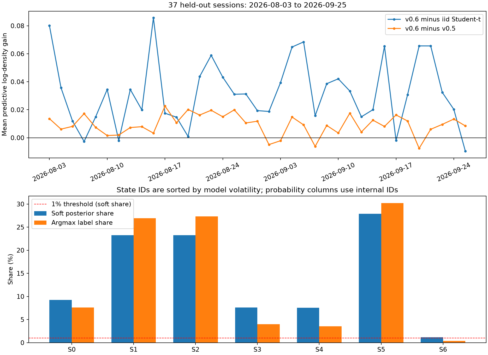

# Phân tích kết quả ARSH v0.6 — 26/09/2026

**Nhận định:** v0.6 cải thiện điểm dự báo phân phối ngoài mẫu trên giai đoạn hiện có. Bằng chứng về mức cải thiện nhất quán hơn bằng chứng về độ bền và ý nghĩa của cả 7 trạng thái. Đây là kết quả nghiên cứu tích cực, chưa phải xác nhận 7 regime ổn định lâu dài.

## Phạm vi và cách kiểm tra

- Nguồn tải: nhánh `v0.6`, commit `e8c924bd53c1411c18aa05560ed754a34b0c55bc`.
- Đọc báo cáo, kế hoạch đã khóa, quyết định K, cấu hình, manifest, diagnostics, mã fit/evaluate/replay và 37 CSV từng quan sát.
- Model mới: Student-t HMM có bậc tự do chung, K=7, lợi suất 1 phút, chia chuỗi theo ngày. Cửa sổ fit cuối: 01/08/2023–31/07/2026, 177.695 quan sát. Holdout: 03/08–25/09/2026, 37 phiên, 8.796 quan sát.
- Kiểm tra SHA-256 của model, kế hoạch, cấu hình, mã fit, ba module v0.5 được dùng lại, mã evaluate theo EVALUATION_LOCK và artifact đối chứng v0.5: đều khớp. Mã tham chiếu lấy trực tiếp từ commit với kết thúc dòng nguyên gốc.
- Tính lại causal filter và log density từ lợi suất đã lưu, với bộ chuẩn hóa/model cố định. Sai khác posterior lớn nhất so với CSV: khoảng `9,21e-13`; điểm dự báo và thời lượng khớp số liệu gốc trong sai số số học.
- **Chưa tái tạo từ nến nguồn hoặc DB:** CSV huấn luyện và nến thô từng ngày không nằm trong bộ tải. Kiểm tra này xác nhận tính nhất quán của model và kết quả đã lưu, không kiểm chứng độc lập toàn bộ nguồn dữ liệu hoặc fit lại model.

## 1. Điểm dự báo cải thiện và tương đối nhất quán trong mẫu kiểm tra

| Chỉ tiêu | Student-t độc lập | Artifact v0.5 | Model v0.6 |
|---|---:|---:|---:|
| Log density dự báo trung bình | 6,116191 | 6,139291 | **6,148601** |
| Độ tin cậy posterior trung bình | — | 0,593293 | **0,615092** |
| Tỷ lệ hiện diện mềm nhỏ nhất | — | 0,6985% | **1,1974%** |
| Độ dài chuỗi nhãn trung bình, quan sát | — | 1,7730 | **2,2653** |
| Tỷ lệ chuỗi chỉ một quan sát | — | 57,49% | **58,90%** |

Chênh lệch của v0.6 là `+0,032410` so với Student-t độc lập và `+0,009310` so với v0.5, trên mỗi quan sát. Quy đổi bằng hàm mũ, tỷ số mật độ hình học tương ứng là khoảng **1,03294** và **1,00935**. Đây là cải thiện điểm dự báo phân phối; không phải tăng 3,29%/0,94% độ chính xác hướng giá hay lợi nhuận.

v0.6 hơn Student-t độc lập ở **33/37 phiên**, và cũng hơn v0.5 ở **33/37 phiên**. Vì vậy mức cải thiện không chỉ xuất hiện ở một phiên cá biệt. Chênh lệch với v0.5 theo tháng là `+0,010817` trong tháng 8 và `+0,007537` trong phần tháng 9 đã quan sát: vẫn dương nhưng thu hẹp.

Đối chứng này so sánh hai artifact thực tế. Model v0.5 dùng `student_t_state`, fit đến trước 06/11/2025; v0.6 dùng `student_t_shared`, fit đến trước 01/08/2026. Cửa sổ dữ liệu và họ HMM cùng thay đổi, còn lõi mã v0.5 được dùng lại. **Không thể quy toàn bộ cải thiện cho một thay đổi thuật toán riêng của v0.6.**

Tôi tính thêm bootstrap thăm dò bằng các khối phiên liên tiếp, 10.000 mẫu, giữ các quan sát trong một phiên đi cùng nhau và tính trung bình có trọng số số quan sát. Với khối 5 phiên, khoảng percentile 95% của gain là `[0,02611; 0,03819]` so với Student-t và `[0,00670; 0,01224]` so với v0.5. Thử độ dài khối 1/3/5/10 đều cho khoảng dương trong dữ liệu này. Đây là **phân tích bổ sung sau khi xem kết quả**, chỉ dựa trên 37 phiên, phụ thuộc giả định resampling; không thay tiêu chí đã khóa và không bảo đảm mức cải thiện ở tương lai.

## 2. S6 là hạn chế nổi bật của lựa chọn K=7

Tiêu chí chính thức dùng tỷ lệ hiện diện mềm trên **toàn bộ** giai đoạn: trung bình posterior của từng state. S6 đạt **1,1974%**, vượt ngưỡng 1% khoảng **0,1974 điểm phần trăm**.

Khi chia theo tháng:

| Trạng thái | Tháng 8, 20 phiên | Tháng 9 đến 25/09, 17 phiên |
|---|---:|---:|
| S0 | 6,10% | 12,98% |
| S5 | 34,21% | 20,45% |
| **S6** | **1,62%** | **0,70%** |

S6 dưới 1% trong **22/37 phiên**. Nếu chọn state bằng posterior lớn nhất, S6 chỉ có **31/8.796 quan sát (0,352%)**, xuất hiện trong **7 phiên**, tạo **13 chuỗi nhãn**. Tổng posterior của S6 tương đương khoảng 105,32 quan sát về mặt trọng số; đó không phải 105 quan sát độc lập được xác nhận thuộc state này.

Điều này không làm kết quả PASS chính thức sai: kế hoạch không yêu cầu mỗi tháng hoặc mỗi ngày đều đạt 1%. Tuy nhiên, kết quả cho thấy **PASS gộp không đồng nghĩa mọi state ổn định theo thời gian**. S6 là state có độ lệch chuẩn lớn nhất, nên có thể biểu diễn những giai đoạn biến động hiếm. Mẫu này chưa đủ để phân biệt một state hiếm có ích với một thành phần thiếu ổn định; cũng chưa có căn cứ để tự động bỏ S6 hay đổi K.

## 3. Bảy trạng thái có độ bền rất khác nhau

Các tham số dưới đây là phân phối lợi suất do model đã fit mô tả. Dấu của trung bình không xác nhận hướng giá trong phút tiếp theo.

| State | Trung bình lợi suất model, % | Độ lệch chuẩn model, % | Hiện diện mềm | Chuỗi nhãn trung bình, quan sát |
|---|---:|---:|---:|---:|
| S0 | -0,000007 | 0,02461 | 9,26% | 4,81 |
| S1 | -0,01877 | 0,02863 | 23,27% | 1,60 |
| S2 | +0,02090 | 0,02897 | 23,24% | 1,59 |
| S3 | -0,04476 | 0,04949 | 7,61% | 1,32 |
| S4 | +0,04130 | 0,05498 | 7,55% | 1,43 |
| S5 | +0,00041 | 0,07747 | 27,89% | 10,31 |
| S6 | -0,00556 | 0,17432 | 1,20% | 2,38 |

S1/S2 và S3/S4 có trung bình trái dấu và thời gian nhãn rất ngắn; S5 có trung bình gần 0, biến động cao hơn S0–S4 và nhãn duy trì lâu hơn. Đây là dấu hiệu model vừa tách mức biến động vừa tách các thành phần lợi suất trái dấu, thay vì tạo bảy state có cùng mức độ bền.

**58,90% chuỗi nhãn chỉ dài một quan sát, trung vị là 1.** So với v0.5, độ dài trung bình tăng khoảng 27,8% nhưng tỷ lệ chuỗi một quan sát tăng khoảng 1,41 điểm phần trăm. Hai số cùng đúng: một số chuỗi dài hơn có thể nâng trung bình, trong khi nhiều chuỗi vẫn đổi rất nhanh.

Thời lượng trên được tính theo quan sát lợi suất hợp lệ, không phải phút đồng hồ liên tục; nghỉ trưa và khoảng thiếu được xử lý theo policy/reset. Thời lượng nhãn argmax cũng khác thời lượng trạng thái ẩn suy ra từ đường chéo ma trận chuyển. Ví dụ S5 có thời lượng ẩn kỳ vọng khoảng 74,55 quan sát theo `1/(1-Pii)`, nhưng chuỗi nhãn argmax trung bình chỉ 10,31; posterior có thể lưỡng lự giữa các phân phối chồng lấn.

Độ tin cậy 0,615 là trung bình xác suất lớn nhất trong bảy posterior, **không phải độ chính xác 61,5%**. Khoảng **27,97%** quan sát có xác suất lớn nhất dưới 0,5; chỉ **15,92%** đạt ít nhất 0,8. Đầu ra đầy đủ bảy xác suất có giá trị diễn giải hơn việc chỉ nhìn một nhãn.

## 4. Lựa chọn họ HMM hợp lý theo quy tắc, nhưng hội tụ cần ghi chính xác

Trên validation 02–07/2026, `student_t_shared` có log density 6,168386; `student_t_state` là 6,167970, chỉ kém `0,000416`. Hai họ Student-t nằm trong biên hòa 0,002; chọn họ chung df phù hợp quy tắc ưu tiên ít tham số. Khoảng cách này không chứng minh họ chung df vượt trội trong mọi giai đoạn.

Cả **9 lần fit screening**, ba họ × ba seed, đều ghi `converged=false`, `strict_converged=false`. Hàm `fit_hmm_restarts` dùng seed hội tụ nếu có; nếu không có thì vẫn chọn fit có likelihood huấn luyện cao nhất. Vì vậy kết quả chọn họ là kết quả với ngân sách 100 vòng, chưa phải so sánh giữa các nghiệm đều đã hội tụ.

Cả **5 seed fit cuối** ghi `converged=true` nhưng **`strict_converged=false`**, và dùng hết 300 vòng. Tiêu chí thực dụng trong mã là delta không âm đáng kể và delta/quan sát < `1e-5`; tiêu chí chặt dùng tolerance 0,01 của monitor. Seed được lưu là **145**, có delta khoảng **0,05635**, delta/quan sát khoảng **3,17e-7**.

Nên mô tả: **model cuối đạt tiêu chí hội tụ thực dụng, chưa đạt tiêu chí chặt**. Diagnostics likelihood qua seed chưa cung cấp phép ghép state để chứng minh ý nghĩa từng state ổn định qua seed.

K=7 là quyết định thiết kế có bằng chứng validation lịch sử, không phải kết luận tối ưu toàn cục. K=7 nằm ở biên trên miền K=2–7 đã so sánh; đối chứng K=5/6 và phép thử biên K=8/9 vẫn là công việc nghiên cứu riêng nếu cần giải thích lựa chọn này.

## 5. Chất lượng dữ liệu và ý nghĩa báo cáo cuối ngày

Có 84 cửa sổ bị loại trong holdout; con số này gồm cả cửa sổ biên phiên thường lệ, không thể coi tất cả là mất dữ liệu. Hai phiên có cảnh báo phút thiếu là 18/08 và 25/09. Bỏ cả hai phiên trong phép kiểm tra bổ sung, còn 35 phiên/8.330 quan sát: gain so với Student-t là `+0,034085`, so với v0.5 là `+0,009294`, tỷ lệ mềm S6 là **1,2480%**. Kết luận gộp không phụ thuộc riêng hai phiên này.

Kế hoạch ghi rõ trước khi khóa đã xem một số số liệu tổng hợp tháng 8–9 của artifact v0.5, dù chưa xem model mới. Do đó không nên gọi giai đoạn này là một holdout hoàn toàn mù ở cấp dự án. Trong mã đã đọc, scaler và fit model mới đều dùng dữ liệu trước 01/08; scoring dùng bộ lọc nhân quả. Tuy vậy, dữ liệu nạp bù không lưu được chính xác thời điểm từng nến có sẵn trong lịch sử. Kết quả hiện có xác nhận replay trên dữ liệu hoàn tất, chưa chứng minh hiệu năng vận hành trực tiếp với độ trễ và bản sửa dữ liệu thực tế.

Tất cả 37 báo cáo JSON có quan sát cuối gắn timestamp **14:29**, thuộc phần dữ liệu liên tục, không dùng ATC vào lợi suất chính. `final_state_id` là state của **quan sát cuối**; nó không đại diện cho state chủ đạo của cả ngày. Phiên 25/09 kết thúc ở S1 với confidence **0,39479**, thấp; riêng nhãn đó không đủ để mô tả chắc chắn cả ngày là một state.

Một điểm dễ đọc nhầm: tên cột `p_state_0`…`p_state_6` là **ID nội bộ**, còn `v06::S0`…`S6` được sắp theo độ lệch chuẩn. Mapping của artifact hiện tại:

| Cột xác suất | State hiển thị |
|---|---|
| p_state_0 | S0 |
| p_state_1 | S3 |
| p_state_2 | S4 |
| p_state_3 | S2 |
| p_state_4 | S5 |
| p_state_5 | S1 |
| p_state_6 | S6 |

Không được mặc định `p_state_1` là xác suất của S1. ID trong hai artifact v0.5/v0.6 cũng không có cùng ý nghĩa chỉ vì tên hoặc thứ tự gần nhau.

## Việc cần kiểm chứng tiếp

1. Giữ artifact đã khóa để quan sát giai đoạn mới sau 25/09/2026; đánh giá gain, occupancy S6 và thời lượng theo cửa sổ phiên đã định trước. Dữ liệu 03/08–25/09 đã xem, không dùng lại làm holdout độc lập nếu thay model theo phân tích này.
2. Kiểm tra ý nghĩa và khả năng ghép state qua seed/fold; tách độ bền trạng thái ẩn khỏi nhiễu nhãn argmax. Nếu nghiên cứu quy tắc xác nhận/làm mượt nhãn, đánh giá cả độ trễ và các chuyển đổi bỏ lỡ trên giai đoạn khác.
3. Nếu cần kiểm chứng lựa chọn họ HMM/K sâu hơn, so ứng viên với hội tụ rõ ràng và đối chứng cùng cửa sổ dữ liệu; không tối ưu lại trên holdout đã xem.
4. Báo cáo ngày nên nêu timestamp quan sát cuối, bảy xác suất với mapping đúng, tỷ lệ hiện diện trong ngày và mức bất định; nhãn cuối ngày chỉ là một phần của báo cáo.

Các bảng tính lại và bootstrap được lưu cạnh báo cáo này. Không thay model, kế hoạch đã khóa hay kết quả gốc.

